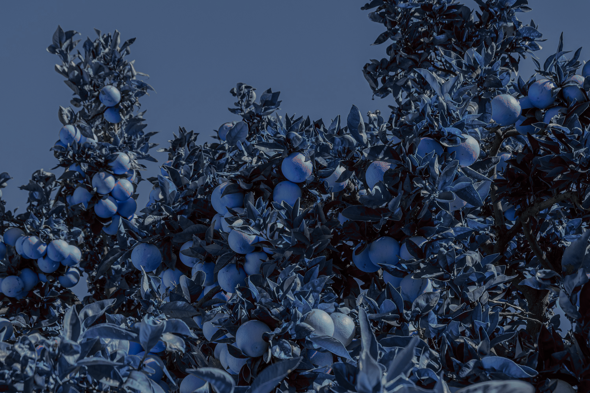
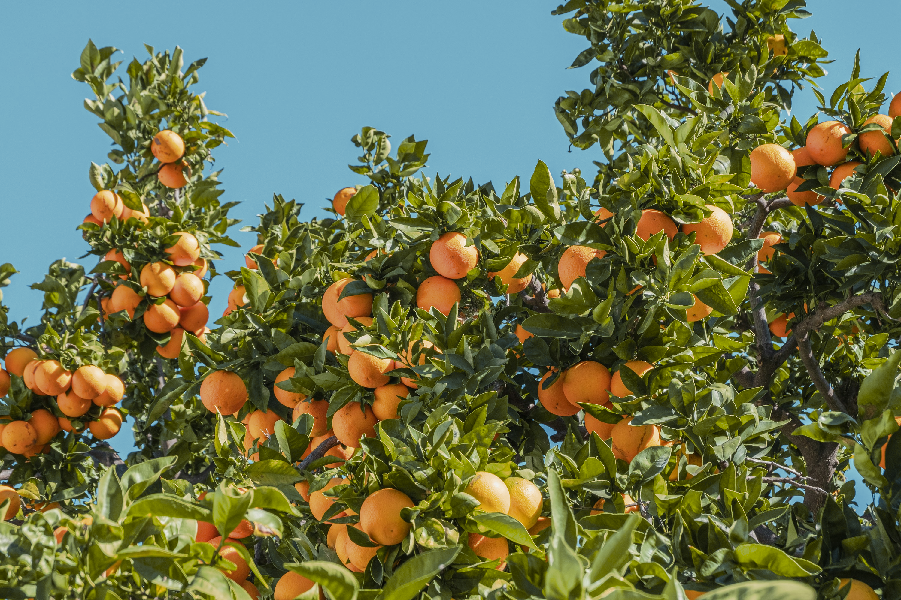

# nordify

Convert any image to the [Nord colour palette](https://www.nordtheme.com/). Colour snapping and dithering operate in the perceptually-uniform [Oklab](https://bottosson.github.io/posts/oklab/) colour space; palette mixing maps pixels onto a convex hull whose geometry varies by mixing model (spectral Kubelka-Munk pigment mixing, or linear-RGB additive light mixing).

## Installation

```bash
python3 -m venv venv
source venv/bin/activate
pip install -r requirements.txt
```

For depth estimation and palette mixing, also install:

```bash
pip install transformers torch torchvision pillow  # depth_blur.py
pip install mlx                        # --mix (Apple Silicon required)
```

## Pipeline

The pipeline is two scripts run in sequence:

```
depth_blur.py  →  nordify.py
(crop + blur)     (palette conversion)
```

### Step 1 — `depth_blur.py`

Crops to a target aspect ratio, estimates monocular depth, and applies a depth-guided defocus (bokeh) blur via layered forward-scatter compositing.

```
python3 depth_blur.py <input> -o <blurred> [options]
```

| Flag | Default | Description |
|------|---------|-------------|
| `--aspect W:H` | `16:9` | Crop aspect ratio |
| `--align` | `center` | Crop alignment: `left`/`center`/`right`/`top`/`bottom` |
| `--no-crop` | — | Skip aspect-ratio cropping |
| `--blur PCT` | `2.0` | Max disc radius (circle of confusion) as % of image height |
| `--levels N` | `16` | Number of depth slabs for scatter compositing |
| `--focus D\|auto` | `0.0` | Focus plane as normalised disparity: `0.0`=background/infinity, `1.0`=foreground, or `auto` to detect the principal figure via SAM segmentation; see [Methods](#automatic-figure-detection---focus-auto) below |
| `--depth-only` | — | Save the blur-strength map and exit (useful for tuning) |
| `--save-depth PATH` | — | Also save the normalised depth map alongside the main output |
| `--save-figure-mask PATH` | — | With `--focus auto`, also save the winning figure region as a mask alongside the main output |
| `--fix-sky` | — | Correct sky/foreground depth inversions (seen on stylised art) using an Otsu-segmented Depth Anything V2 sky mask; see [Methods](#sky-depth-correction---fix-sky) below |
| `--flatten-masts` | — | Flatten thin, tall, solid vertical structures (chimneys, masts) to their own median depth; see [Methods](#mast-depth-flattening---flatten-masts) below |
| `--model MODEL` | Depth Anything V2 Small | HuggingFace depth model ID |

### Step 2 — `nordify.py`

Maps every pixel to a Nord colour. Optionally applies a nighttime pre-processing pass before conversion.

```
python3 nordify.py <input> -o <output> [options]
```

| Flag | Description |
|------|-------------|
| `--dither fs` | Floyd-Steinberg dithering with blue-noise seeding |
| `--mix [spectral\|additive]` | Palette mixing (requires MLX); see [Methods](#palette-mixing---mix) below. |
| `--night` | Nighttime pre-processing: darken and cool the image before palette conversion |

### Utility — `entropy_crop.py`

An alternative to `depth_blur.py`'s `--align left`/`center`/`right`: picks a crop offset that minimises the entropy of the edge source's content it would cut, then applies that same offset to one or more images — useful for re-cropping an already-finished wallpaper to a second aspect ratio (e.g. deriving a 3:2 variant from a 16:9 one) while keeping a day/night pair aligned. The edge source is typically a depth map (`depth_blur.py --save-depth`) so the crop is chosen against object silhouettes rather than painted texture, but any image works. See [Methods](#minimum-entropy-crop-entropy_croppy) below.

```
python3 entropy_crop.py edge_source.png --aspect W:H <in1> <out1> [<in2> <out2> ...]
```

| Flag | Default | Description |
|------|---------|-------------|
| `--aspect W:H` | `16:9` | Target aspect ratio |
| `--visualize PATH` | — | Save a copy of the edge source with the chosen crop boundaries drawn on it |

The edge source is only used to choose the crop offset — it is not implicitly cropped; include it in the `<in> <out>` pairs if it should be too. Every input must be pixel-aligned with the edge source (i.e. the same dimensions).

### Examples

```bash
# Plain colour snapping
python3 nordify.py photo.jpg -o photo_nord.png

# Floyd-Steinberg dithering
python3 nordify.py photo.jpg -o photo_nord.png --dither fs

# Spectral palette mixing
python3 nordify.py photo.jpg -o photo_nord.png --mix

# Additive (linear-light) palette mixing
python3 nordify.py photo.jpg -o photo_nord.png --mix additive

# Nighttime version with spectral mixing
python3 nordify.py photo.jpg -o photo_night.png --night --mix

# Full wallpaper pipeline: 16:9 crop + depth blur, then nordify
python3 depth_blur.py photo.jpg -o blurred.png
python3 nordify.py blurred.png -o wallpaper.png --mix

# 3:2 wallpaper, keeping left side, heavier blur
python3 depth_blur.py photo.jpg -o blurred.png --aspect 3:2 --align left --blur 4
python3 nordify.py blurred.png -o wallpaper.png --mix

# Derive a 3:2 crop from an already-finished 16:9 wallpaper (and its night
# variant) via minimum-entropy cropping against the depth map, keeping both
# pixel-aligned
python3 depth_blur.py photo.jpg -o blurred.png --no-crop --save-depth depth.png
python3 nordify.py blurred.png -o wallpaper.png --mix
python3 entropy_crop.py depth.png --aspect 3:2 \
    wallpaper.png wallpaper_3x2.png \
    wallpaper_night.png wallpaper_night_3x2.png
```

## Samples

Original photo by [Philippe Gauthier](https://unsplash.com/photos/orange-fruits-under-blue-sky-during-daytime-eaOjEz8746k) on Unsplash.

| | |
|---|---|
| **Original** | **Colour snapping** |
|  |  |
| **Floyd-Steinberg dithering** | **Nighttime (`--night`)** |
|  |  |

**Palette mixing (`--mix`):**

| `--mix spectral` (default) | `--mix additive` |
|---|---|
|  |  |

**Wallpaper crop + depth-guided defocus blur + additive palette mixing (`depth_blur.py` → `nordify.py --mix additive`):**


## Methods

### Colour snapping

Each pixel's colour is converted to [Oklab](https://bottosson.github.io/posts/oklab/) — a perceptually uniform space — and its hue is snapped to the nearest palette hue while its lightness and chroma are left unchanged. This preserves the tonal contrast of the original image.

### Floyd-Steinberg dithering with blue noise

[Floyd-Steinberg error diffusion](https://en.wikipedia.org/wiki/Floyd%E2%80%93Steinberg_dithering) in the Oklab (a, b) plane: the palette mismatch at each pixel is propagated to its neighbours with weights 7/16, 3/16, 5/16, 1/16. Before each palette lookup the effective colour is offset by a [blue-noise](https://en.wikipedia.org/wiki/Blue_noise) value (generated via the void-and-cluster algorithm), which breaks up the banding that plain error diffusion can produce in smooth gradients.

### Palette mixing (`--mix`)

Two mixing models, both minimising Oklab distance to each pixel's original colour and both leaving already-reachable pixels unchanged.

**`--mix spectral` (default)** fits a Gaussian reflectance spectrum to each Nord colour, then for every pixel optimises a simplex (Σcᵢ = 1) over the 17 palette K/S spectra to minimise Oklab distance to the target. Mixing in spectral K/S space follows Kubelka-Munk theory: convex combinations of K/S spectra correspond to physically realised opaque paint mixtures.

The pipeline:

1. **Augmented palette** — the 17 pure colours plus all N(N−1)/2 pairwise 50/50 K/S mixtures are assembled. Each pixel is snapped to the nearest augmented entry; pairwise-mixture entries ensure boundary pixels receive interior-simplex starting weights rather than one-hot corners.
2. **Random diversification** — the snapped weights are blended 50/50 with a Dirichlet-sampled random field, then re-projected onto the simplex. This prevents pixels near palette boundaries from stalling in local optima.
3. **Spatial blur** — weights are Gaussian-smoothed across neighbours and re-projected, giving spatially coherent mixing in flat regions.
4. **Adam optimisation** — cosine-decayed Adam refines the simplex weights per strip to minimise Oklab distance to the target.

**`--mix additive`** treats the palette as a set of light sources instead of pigments: the reachable gamut is the convex hull of the 17 colours (plus black and white) in **linear RGB**, which — unlike the K/S spectral gamut — includes ordinary additive colour mixing. Out-of-gamut pixels are first clamped onto this hull, then walked back toward their original colour in Oklab space in two sequential phases — luminance, then chrominance (hue and chroma matched jointly) — each phase run with Adam. Every step's candidate is re-projected onto the hull, so the effective step is always the gradient clamped to the gamut boundary rather than a raw unconstrained step. Because the additive gamut is much larger than the pigment gamut, this model changes photographs more subtly than spectral mixing — visible mainly on strongly saturated or overexposed pixels.

For a more detailed discussion of the algorithms and their artistic rationale, see [BACKGROUND.md](BACKGROUND.md).

### Depth-guided blur (`depth_blur.py`)

Estimates monocular depth via [Depth Anything V2](https://github.com/DepthAnything/Depth-Anything-V2) Small. Depth Anything is a fixed-input-size model — its image processor resizes everything down to a small fixed size (e.g. 518px) regardless of source resolution — so a single whole-image pass alone would destroy thin foreground structures (wires, masts, lattice towers) before the network ever sees them. Instead, several overlapping-tile refinement passes run at different footprint sizes (fractions of the image's width — default `[0.5, 0.25, 0.125]`), each tile least-squares aligned (scale + shift; monocular depth models are only defined up to an unknown per-inference affine transform) directly against the initial whole-image pass and blended internally with tent-feathered edges, and the final depth map is the **per-pixel maximum** across the whole-image pass and all the tile passes. Different footprints have different blind spots — a wide pass gives smooth, consistent depth on solid objects but loses thin wires and blends soft things (steam, smoke) into the sky; a narrow, near-native-resolution pass keeps fine detail (down to a lattice tower's individual crossing struts) but is noisier on large solid objects — and taking the max lets each pass contribute only where it's more confident something is close, so one pass's blind spot can't erase another's correctly-recovered detail. (Apple's Depth Pro is still available via `--model apple/DepthPro-hf`, and skips this tiling entirely — it derives patches from multiple downsamplings of the *original* image internally, so a single pass already sees fine detail with no tiling needed — but it isn't the default: on stylised/painted art it can misjudge large flat regions in a way Depth Anything doesn't, see `--fix-sky` below.) Then applies a telecentric defocus (bokeh) model via layered forward-scatter compositing. The depth map is divided into `--levels` slabs with tent-function membership (an exact partition of unity); each slab forward-scatters its own colour and coverage outward by a disc (pillbox) kernel sized to that slab's circle of confusion — `r = sigma_max · |d − d_focus| / denom` — exactly as a real aperture spreads light from an out-of-focus point. Slabs are then composited front-to-back with premultiplied alpha, so nearer slabs occlude farther ones. Because blur is scattered from each source pixel outward rather than gathered into each output pixel from a neighbourhood sized by its own depth, background bokeh naturally bleeds up to (and is naturally clipped by) sharp foreground edges, and a blurred foreground naturally bleeds semi-transparently over a sharp background — with no heuristic depth dilation needed. Blur runs in linear light with MLX GPU acceleration on Apple Silicon when available.

### Sky depth correction (`--fix-sky`)

No longer needed by the default pipeline — Depth Anything V2 (the default model) doesn't make the mistake this corrects. Still available via `--fix-sky` for anyone using `--model apple/DepthPro-hf`.

Depth Pro, trained on real photographs, can read a flat, desaturated, silhouette-like region as *near* — a strong learned cue for atmospheric haze in photos — even when it's the sky sitting behind a much nearer, plainly-painted structure. Confirmed on a power-station painting, where Depth Pro placed the sky nearer than the building in front of it while Depth Anything V2 got the same region right — an out-of-distribution failure specific to stylised/painted content, not a general flaw. `--fix-sky` corrects it: Depth Anything V2's map is Otsu-thresholded to locate the sky (its single farthest, most tightly-clustered region), then that region's Depth Anything values — least-squares fit to Depth Pro's scale using everything *outside* the sky mask, never the sky itself — are blended into the result through a feathered mask, with a safety clamp guaranteeing the corrected sky never reads nearer than the nearest non-sky pixel. This roughly doubles depth-estimation time (Depth Anything's tiled pass runs alongside Depth Pro's) but that's still small next to `nordify.py --mix`'s per-image runtime.

### Mast depth flattening (`--flatten-masts`)

Superseded by the default pipeline's multi-pass max combination above — the wide (`0.5`) tiling pass already gives smokestacks smooth, consistent depth directly. Still available via `--flatten-masts`.

A thin, tall, rigid vertical structure (a smokestack) can come out of either depth model with substantial internal noise along its height, even though its true depth barely varies top to bottom. `--flatten-masts` finds candidates via [Segment Anything](https://github.com/facebookresearch/segment-anything)'s automatic mask generation on the source image rather than the depth map (using the depth map to find its own errors is circular, and both models place smokestacks near the low/"far" end of their own range, so an Otsu split just lumps them in with sky). Masks are kept only if their own bounding box is tall/narrow — SAM's masks already respect real object boundaries, so the transmission tower's wire lattice (equally thin and tall, but sparse, and which legitimately does vary in depth as it recedes toward a vanishing point) isn't returned as a tall/narrow mask in the first place, unlike an earlier classical contrast-based approach that needed a separate solidity check and still missed a mast embedded in busy painted clouds.

Each surviving mast isn't flattened to a single value outright — that would erase genuine perspective drift on a mast large enough to show any. Instead, each pixel's deviation from the mast's own median depth is clamped to a tolerance band: deviations already inside it pass through untouched, and only the excess — the part with no plausible perspective explanation — gets pulled in. That tolerance shrinks quadratically (not linearly) toward the background, since disparity is proportional to inverse distance: a mast twice as far away can plausibly show only a quarter of the depth spread, not half. In practice this gives the scene's nearest object a full ±15% tolerance, dropping to roughly ±2% for a background-level smokestack.

The clamp only ever pulls a pixel toward its mast's median from the *far* side, never the near side — a mast can't have something genuinely farther "through" it, but a pixel reading nearer could be something real crossing in front (a transmission wire passing over a smokestack was losing its correct depth this way until the clamp was made one-sided).

The image is downsampled (1500px wide by default) before running SAM: its encoder resizes to a fixed internal resolution regardless of input size, so the full-resolution source produces identical mask quality at ~60x the cost (~17 minutes vs. ~17 seconds for one 4500px-wide image).

### Automatic figure detection (`--focus auto`)

Picks the focus plane automatically instead of a manually guessed `--focus D`, by locating the principal "figure" — a compact foreground subject — via [SAM](https://github.com/facebookresearch/segment-anything) segmentation of the source image, then using its median depth as the focus plane.

An earlier version segmented via classical Canny edge detection on the depth map itself instead of SAM. It worked on photos with sharp depth discontinuities, but failed on a stylised power-station painting: Canny traced the cooling tower's silhouette as a visually clear gradient, but the boundary had gaps too small to see by eye and too large for a fixed-size dilation to close, so the tower's "inside" leaked into the surrounding sky and merged into one ~90%-of-frame blob — never even considered as a candidate. SAM (already used by `--flatten-masts` above, for the same reason) has no such failure mode: it segments from the image's own visual boundaries, which are complete and unambiguous even where the depth map's inferred discontinuity is not.

A single object can still come back as several SAM masks (SAM's output is hierarchical, and an occluder can split one object's mask in two). Regions whose depth ranges overlap by more than 50% of both ranges' own extents are merged (transitively, via union-find) into one candidate. Any region touching the image border is dropped *before* this merge, not after — a border-touching region is a partial view of whatever it belongs to, so nothing measured from it can be trusted, and filtering post-merge would let one small, unrelated, border-touching mask disqualify an otherwise-large, clean interior candidate purely because it coincidentally shares a similar depth (confirmed: a 5,669px sliver of sky merged into, and discarded, an otherwise-clean 348,847px cooling-tower group before this was fixed).

Each merged candidate is ranked on five criteria via weighted rank-sum: **area** (weight 6 — deliberately the heaviest, since shape criteria alone let a small, incidentally cleaner-shaped blob beat a correctly-identified but 10x-larger subject), **chunkiness** (weight 2 — the fraction of a mask's area surviving erosion by a radius proportional to its own size; unlike bounding-box aspect ratio, this tells a solid tall structure like a cooling tower apart from a thin sliver of the same elongation, since only the sliver erodes away), **solidity** (weight 2 — mask area / convex-hull area), **connectedness** (weight 2 — largest spatial blob / total merged area, penalising a merge of same-depth but spatially disjoint objects), and **median depth** (weight 1 — nearer wins). Ties are averaged rather than broken by list order, since many candidates genuinely tie at connectedness = 1.0.

### Minimum-entropy crop (`entropy_crop.py`)

Slides the crop window along whichever axis the target aspect ratio needs to narrow and scores each candidate offset by how much of the edge source's content its two boundaries would cut. The edge source is usually a depth map (from `depth_blur.py --save-depth`): its edges are exactly object silhouettes, so cutting one means clipping a real object — unlike a colour image, whose Sobel edges also fire on brushwork and painted texture that have nothing to do with where objects actually are (a colour image still works if no depth map is available). Sobel gradient magnitude (continuous, not thresholded like Canny — a palette-snapped colour image is mostly flat colour and would leave Canny nearly empty) stands in for "how much is here to lose."

Rather than sampling only the exact boundary row/column, every row/column in the *entire* kept window contributes, weighted by a parabola that's 1 at each boundary and falls smoothly to 0 at the window's own centre — no arbitrary cutoff width to pick, while still concentrating the score on content near the cut (a clipped feature's gradient peak doesn't always land precisely on the cut line — antialiasing, blur, a not-quite-axis-aligned object). Treating that weighted gradient magnitude as an unnormalised distribution over rows/columns, entropy is low when the cut is concentrated (mostly flat, only clipping something in a narrow span) and high when it's smeared across many different objects; cutting nothing scores zero. Ties at zero entropy break on total edge weight cut, ascending — preferring the offset that clips the least even when both clip "nothing significant."

It has no notion of what an object *is*, only where the edge source changes sharply — so it can occasionally prefer clipping a large, low-contrast area over a small but sharp-edged one nearby if that minimises the boundary's entropy. Its notion of foreground vs. background comes entirely from whatever edge source it's given: fed a depth map, it favours cuts that avoid silhouettes; fed a colour image, it only knows "how confidently something's outline sits on this line," with no sense of near vs. far.

### Nighttime pre-processing (`--night`)

Transforms pixel colours in Oklab before palette conversion:

- **Luminance** — `L → 1 − √(1 − L)`: a curve that darkens mid-tones and highlights while keeping shadows from crushing to black.
- **Yellow/blue axis** — `b` is shifted toward blue in inverse proportion to luminance: dark pixels receive the full shift (warming tones become cool), bright pixels are left unchanged (artificial lights and highlights keep their original colour temperature).

## Nord Palette

| Group | Colours |
|-------|---------|
| Polar Night | nord0 `#2E3440` · nord1 `#3B4252` · nord2 `#434C5E` · nord3 `#4C566A` |
| Snow Storm | nord4 `#D8DEE9` · nord5 `#E5E9F0` · nord6 `#ECEFF4` |
| Frost | nord7 `#8FBCBB` · nord8 `#88C0D0` · nord9 `#81A1C1` · nord10 `#5E81AC` |
| Aurora | nord11 `#BF616A` · nord12 `#D08770` · nord13 `#EBCB8B` · nord14 `#A3BE8C` · nord15 `#B48EAD` |

---

*Developed with [Claude Code](https://claude.ai/code)*
