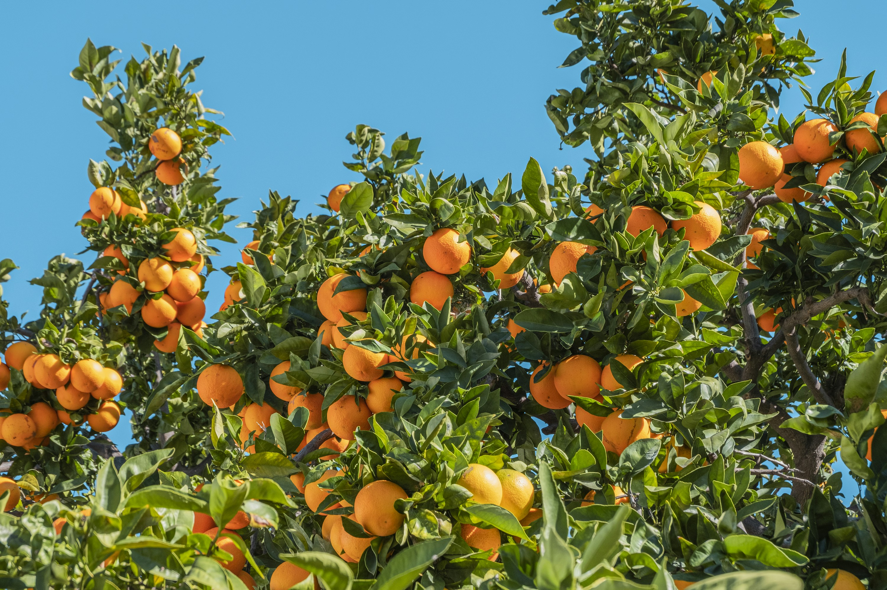
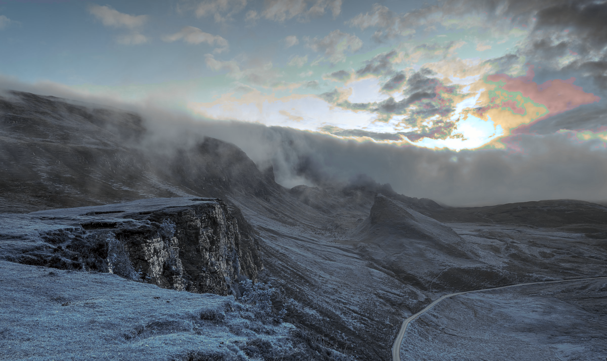
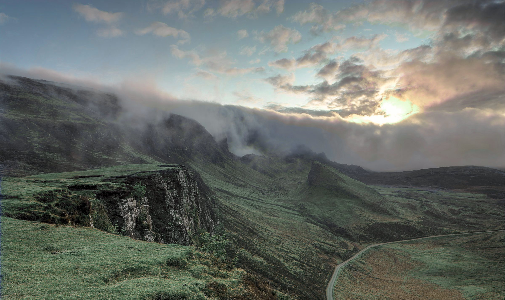
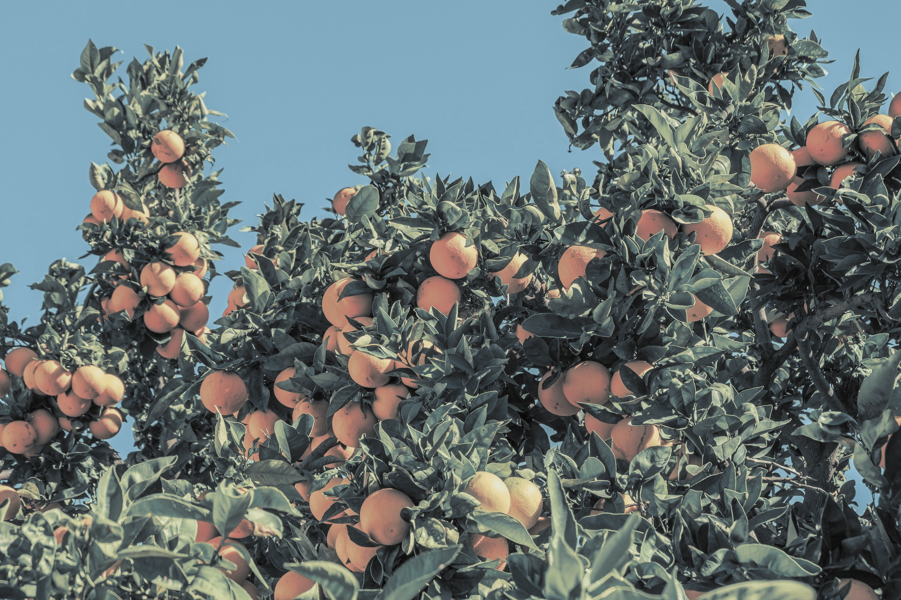
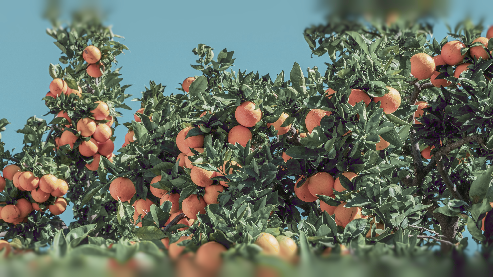

# nordify

Convert any image to the [Nord colour palette](https://www.nordtheme.com/). Colour snapping and dithering operate in the perceptually-uniform [Oklab](https://bottosson.github.io/posts/oklab/) colour space; palette mixing uses a convex-hull model in linear RGB with Oklab-based optimisation targets.

## Installation

```bash
python3 -m venv venv
source venv/bin/activate
pip install -r requirements.txt
```

For palette mixing (`--mix`), also install:

```bash
pip install mlx   # Apple Silicon (required for --mix)
```

## Usage

```
python3 nordify.py <input> -o <output> [--dither fs] [--mix] [--wallpaper] [--aspect W:H] [--align ALIGN] [--blur PCT] [--edges EDGES]
```

| Flag | Description |
|------|-------------|
| `--dither fs` | Floyd-Steinberg dithering with blue-noise seeding |
| `--mix` | Palette mixing gamut mapping |
| `--wallpaper` | Crop to target aspect ratio and apply gradient blur at edges |
| `--aspect W:H` | Crop aspect ratio for `--wallpaper` (default: `16:9`) |
| `--align ALIGN` | Crop alignment: `left`, `center`, `right`, `top`, `bottom` (default: `center`) |
| `--blur PCT` | Max Gaussian blur sigma as % of image height for `--wallpaper` (default: `2`) |
| `--ramp PCT` | Blur ramp width as % of image height for `--wallpaper` (default: `50`) |
| `--edges EDGES` | Comma-separated edges to blur: `top,bottom,left,right` (default: `top,bottom`) |

### Examples

```bash
# Plain colour snapping
python3 nordify.py photo.jpg -o photo_nord.png

# Floyd-Steinberg dithering
python3 nordify.py photo.jpg -o photo_nord.png --dither fs

# Palette mixing
python3 nordify.py photo.jpg -o photo_nord.png --mix

# Wallpaper (16:9 crop + edge blur, combinable with any mode)
python3 nordify.py photo.jpg -o wallpaper.png --mix --wallpaper

# Wallpaper for a 3:2 display, keeping the right side of the image
python3 nordify.py photo.jpg -o wallpaper.png --mix --wallpaper --aspect 3:2 --align right

# Wallpaper with custom blur and ramp
python3 nordify.py photo.jpg -o wallpaper.png --mix --wallpaper --blur 5 --ramp 30
```

## Samples

Original photo by [Philippe Gauthier](https://unsplash.com/photos/orange-fruits-under-blue-sky-during-daytime-eaOjEz8746k) on Unsplash.

| | |
|---|---|
| **Original** | **Colour snapping** |
|  |  |
| **Floyd-Steinberg dithering** | **Palette mixing** |
|  |  |

**Palette mixing + wallpaper crop:**



## Methods

### Colour snapping

Each pixel's colour is converted to [Oklab](https://bottosson.github.io/posts/oklab/) — a perceptually uniform space — and its hue is snapped to the nearest palette hue while its lightness and chroma are left unchanged. This preserves the tonal contrast of the original image.

### Floyd-Steinberg dithering with blue noise

[Floyd-Steinberg error diffusion](https://en.wikipedia.org/wiki/Floyd%E2%80%93Steinberg_dithering) in the Oklab (a, b) plane: the palette mismatch at each pixel is propagated to its neighbours with weights 7/16, 3/16, 5/16, 1/16. Before each palette lookup the effective colour is offset by a [blue-noise](https://en.wikipedia.org/wiki/Blue_noise) value (generated via the void-and-cluster algorithm), which breaks up the banding that plain error diffusion can produce in smooth gradients.

### Palette mixing (`--mix`)

Palette mixing treats Nord colours like paints: any colour achievable by mixing them is in the *palette gamut* — a [convex hull](https://en.wikipedia.org/wiki/Convex_hull) in linear RGB space. Pixels already inside the gamut pass through unchanged; pixels outside are remapped to the nearest achievable colour via a three-phase optimisation in Oklab that mirrors how an artist builds up a painting:

1. **Lightness first** — establish the light/dark structure (the *value sketch*).
2. **Hue second** — lay in colour temperature and hue relationships.
3. **Chroma last** — push or pull colour intensity while holding the value and hue already achieved.

Each phase runs [Adam gradient descent](https://en.wikipedia.org/wiki/Stochastic_gradient_descent#Adam) with the colour snapped back onto the hull boundary after every step. Image chroma is pre-clamped to the palette's chroma range before optimisation.

For a more detailed discussion of the algorithms and their artistic rationale, see [BACKGROUND.md](BACKGROUND.md).

### Wallpaper preparation (`--wallpaper`)

Crops the image to a target aspect ratio (default `16:9`), then blends in a Gaussian-blurred version toward selected edges using a [smoothstep](https://en.wikipedia.org/wiki/Smoothstep) ramp. `--aspect W:H` sets the ratio; `--align` controls which part of the image is kept (`left`/`center`/`right` when cropping width, `top`/`center`/`bottom` when cropping height). `--ramp` sets the spatial extent of the blend ramp as a percentage of image height (default 50%); `--blur` sets the maximum Gaussian sigma as a percentage of image height (default 2%), applied via a 16th-power ramp so blur is tightly concentrated at the very edge and the centre remains sharp. The blur is applied to the original image before nordification, so blended edge pixels are mapped into the Nord palette rather than mixing already-snapped colours outside the gamut. `--edges` selects which edges are blurred (default `top,bottom`, to accommodate a menu bar and dock).

## Nord Palette

| Group | Colours |
|-------|---------|
| Polar Night | nord0 `#2E3440` · nord1 `#3B4252` · nord2 `#434C5E` · nord3 `#4C566A` |
| Snow Storm | nord4 `#D8DEE9` · nord5 `#E5E9F0` · nord6 `#ECEFF4` |
| Frost | nord7 `#8FBCBB` · nord8 `#88C0D0` · nord9 `#81A1C1` · nord10 `#5E81AC` |
| Aurora | nord11 `#BF616A` · nord12 `#D08770` · nord13 `#EBCB8B` · nord14 `#A3BE8C` · nord15 `#B48EAD` |

---

*Developed with [Claude Code](https://claude.ai/code)*
